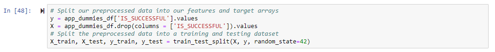
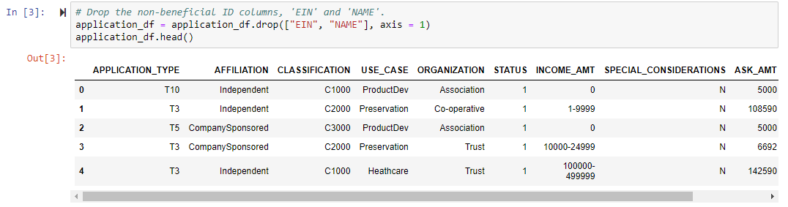

# Deep Learning Charity Funding Predictor Analysis

## Overview of the Analysis

The purpose of this analysis is to determine if organizations will be successful if they receive funding from Alphabet Soup. The analysis takes into account organizations that have receieved funding in the past and, based on past success, determines if they will be successful with new funding. The analysis uses machine learning and neural networks to analyze 34,000 organizations and create a model that can be used for predictions. 

## Results

### Data Preprocessing

-- What variable(s) are the target(s) for your model?

The target variable for this model is the "IS_SUCCESSFUL" data column since it is a direct indicator of whether a company was previously successful with funding from Alphabet Soup. 

-- What variable(s) are the features for your model?

The features of the model include: APPLICATION_TYPE—Alphabet Soup application type, AFFILIATION—Affiliated sector of industry, CLASSIFICATION—Government organization classification, USE_CASE—Use case for funding, ORGANIZATION—Organization type, STATUS—Active status, INCOME_AMT—Income classification, SPECIAL_CONSIDERATIONS—Special consideration for application, and ASK_AMT—Funding amount requested. 

-- What variable(s) should be removed from the input data because they are neither targets nor features?

In the initial model, the "EIN" and "NAME" columns are removed because their data does not benefit the analysis. 

### Compiling, Training, and Evaluating the Model

- How many neurons, layers, and activation functions did you select for your neural network model, and why?

- Were you able to achieve the target model performance?
- What steps did you take in your attempts to increase model performance?

## Summary

Summarize the overall results of the deep learning model. Include a recommendation for how a different model could solve this classification problem, and then explain your recommendation.
