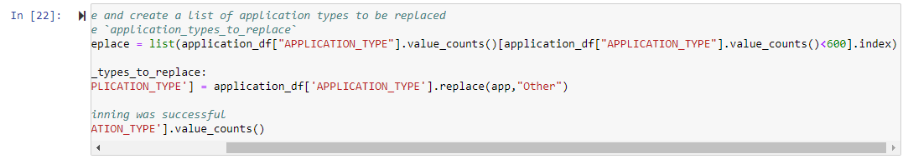

# Deep Learning Charity Funding Predictor Analysis

## Overview of the Analysis

The purpose of this analysis is to determine if organizations will be successful if they receive funding from Alphabet Soup. The analysis takes into account organizations that have receieved funding in the past and, based on past success, determines if they will be successful with new funding. The analysis uses machine learning and neural networks to analyze 34,000 organizations and create a model that can be used for predictions. 

## Results

### Data Preprocessing

-- What variable(s) are the target(s) for your model?

The target variable for this model is the "IS_SUCCESSFUL" data column since it is a direct indicator of whether a company was previously successful with funding from Alphabet Soup. 

-- What variable(s) are the features for your model?

The features of the model include: APPLICATION_TYPE—Alphabet Soup application type, AFFILIATION—Affiliated sector of industry, CLASSIFICATION—Government organization classification, USE_CASE—Use case for funding, ORGANIZATION—Organization type, STATUS—Active status, INCOME_AMT—Income classification, SPECIAL_CONSIDERATIONS—Special consideration for application, and ASK_AMT—Funding amount requested. 

-- What variable(s) should be removed from the input data because they are neither targets nor features?

In the initial model, the "EIN" and "NAME" columns are removed because their data does not benefit the analysis. 

### Compiling, Training, and Evaluating the Model

- How many neurons, layers, and activation functions did you select for your neural network model, and why?

The neurons, hidden layers, and activation functions for our model can be seen in the image below. Non-linear activations were used in the hidden layers in an attempt to detect non-linear patterns. Two hidden layers were used in the initial model because the data did not appear to be overly complex. 

- Were you able to achieve the target model performance?

The initial model was below the desired level of accuracy (see image below).

The following images show the accuracy levels of three attempts to optimize the model. The first two optimization attemts led to marginal improvements in accuracy. However, the third attempt led to a decline in model accuracy. 

- What steps did you take in your attempts to increase model performance?

In the first optimization attempt, I dropped the "STATUS" column and increased the bucket cutoff from 200 to 600. 

My next attempt included an increase to the bucket cutoff for "CLASSIFICATION" from 800 to 2000. Additionally, I adjusted the units in each hidden layer.

My final attempt included changes to the units in the layers, adding an additional hidden layer, and changing the activation for the output layer. 

## Summary

Overall, all of the models performed with about 72% accuracy. While these are solid numbers, our goal for this project was to create a model that would produce an accuracy of 75%. Given its higher interpretiability and very high accuracy, it is recommended that a random forest model is used instead of a neural network. Also, the random forest model will help us to determine which variable are most important. This will, in turn, allow us to decide if additional columns should be dropped in our model to improve accuracy. 
